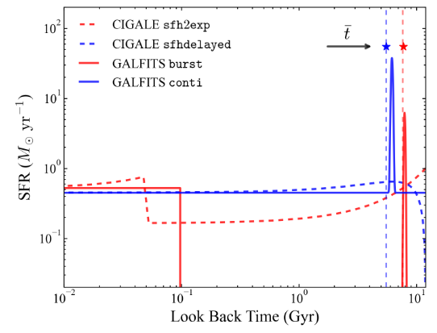
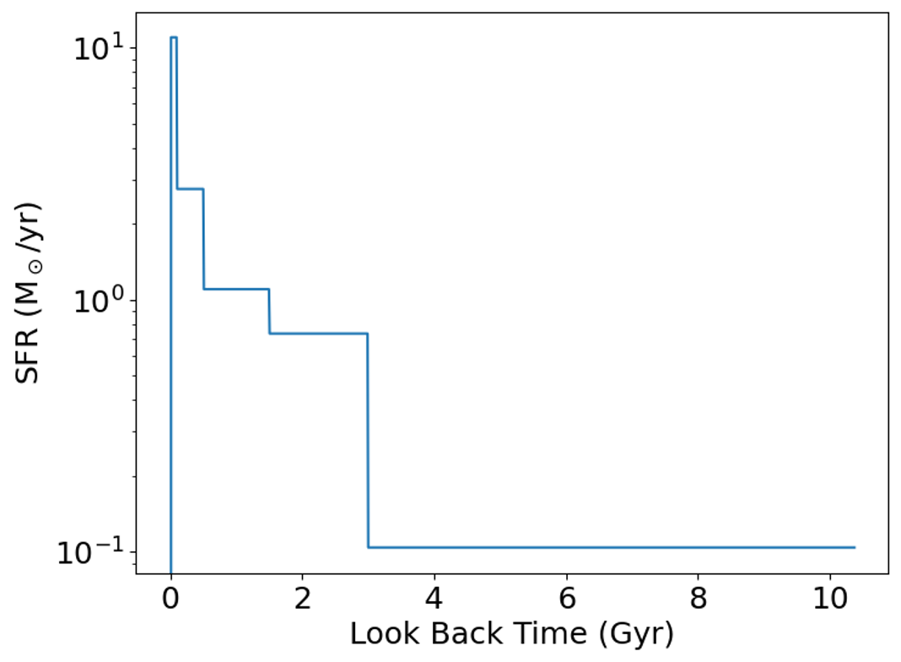
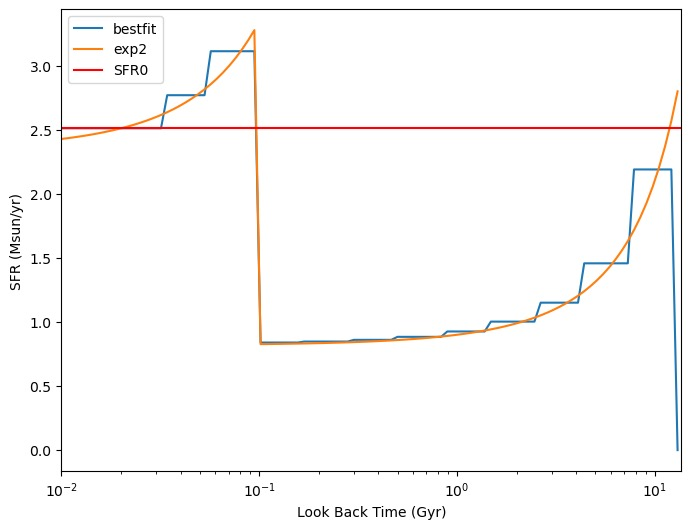

Appendix
============

Star Formation History in GalfitS
------------------------------------------------

### Setting SFH Model

In GalfitS, each profile (e.g., bulge, disk, spiral arms) can be assigned a distinct star formation history (SFH). GalfitS supports three types of SFH for each profile: **burst**, **continuous (conti)**, and **bins**. The type of SFH is specified in the 15th parameter of the profile configuration, as shown below:

```
Pa15) bins  # star formation history type: burst/conti/bins
```

#### Burst and Continuous SFH

- **Burst SFH**: Represents a recent starburst event. It consists of a stellar population with a constant star formation rate (SFR) over the last 100 Myr, combined with a single stellar population (SSP) that approximates the galaxy's mass-building phase at a specific burst age.
- **Continuous SFH**: Models a more gradual star formation process, with a constant SFR starting from 200 Myr after the Big Bang, plus an SSP representing an older burst.

These SFH types are illustrated in the figure below, which compares them to other common SFH models like double exponential and delayed-tau models used in CIGALE.

```


   Example of bursty (burst) and continuous SFH (conti) in GalfitS, and their comparison with double exponential (sfh2exp) and delayed tau SFH (sfhdelayed) in CIGALE. The dashed curves represent the sfh2exp (in red) and sfhdelayed (in blue) models, with the vertical dashed line indicating the weighted stellar age (:math:`\bar{t}`, Equation 19). The parameters for these curves are randomly sampled as in Section 4.1.2. The solid curves show the SFHs recovered by fitting mock photometric data points generated based on the SFHs of the dashed curves, using the burst (red) and conti (blue) models in GalfitS, respectively. This approach demonstrates a good agreement in the shape of the input (dashed curves) and output (solid curves) SFHs. The fitted values of :math:`\bar{t}`, marked by stars on the graph, also closely match the input values.
```

#### Bins SFH

- **Bins SFH**: A more flexible approach where the SFH is divided into discrete time bins, each with a constant SFR. The SFR in each bin is controlled by the 9th parameter (``Pa9``), and the ages of the bins are defined by the 10th parameter (``Pa10``). The bins must be ordered from most recent (first bin, typically at 0 Gyr) to oldest (last bin).

The three SFH types have distinct functional shapes and are controlled by the 9th and 10th parameters. Examples of their configurations are provided below:

- **For Burst SFH**:

```
Pa9) [[-1,-4,0,0.1,1]]  # contemporary log star formation fraction
Pa10) [[5,0.01,10,0.1,1]]  # burst stellar age [Gyr]
```

  - ``Pa9``: Logarithm of the fraction of stellar mass formed in the last 100 Myr.
  - ``Pa10``: Look-back time (age) of the SSP representing the burst.

- **For Continuous SFH**:

```
Pa9) [[-1,-4,0,0.1,1]]  # contemporary log star formation fraction
Pa10) [[5,0.01,10,0.1,1]]  # burst stellar age [Gyr]
```

  - ``Pa9``: Logarithm of the fraction of stellar mass formed since 200 Myr after the Big Bang.
  - ``Pa10``: Age of the SSP burst.

- **For Bins SFH**:

```
Pa9) [[-2,-8,0,0.1,1],[-2,-8,0,0.1,1],[-2,-8,0,0.1,1],[-2,-8,0,0.1,1],[-1,-8,0,0.1,0]]  # logMass_fraction formed at each time bin
Pa10) [0.,0.1,0.5,1.5,3,13.6]  # age time bins [Gyr]
```

  - ``Pa9``: Logarithm of the stellar mass fraction formed in each bin (length: number of bins). The last fraction is typically fixed to avoid degeneracy.
  - ``Pa10``: Look-back ages defining the bin edges (length: number of bins + 1), ranging from 0 Gyr (most recent) to the oldest age (e.g., 13.6 Gyr).

The burst and continuous SFHs provide simpler models with fewer parameters, while the bins SFH offers greater flexibility by allowing the user to define custom time intervals and SFRs for a more detailed reconstruction of the galaxy's star formation history.

### Visualizing SFH Results

After fitting, the SFH can be visualized using the following Python code:

```
.. code-block:: python

    # The galaxy is at z=0.2691, cosmic age about 10.57 Gyr
    pltwave, Sedcomp, Sedlabel, z0 = Myfitter.cal_model_image()
    modelg = Myfitter.model_list[1]
    times, SFHs = modelg.get_SFH()

    fig = plt.figure(figsize=(8,6))
    plt.plot(times, SFHs[0])
    plt.xlabel('Look Back Time (Gyr)', fontsize=18)
    plt.ylabel('SFR (M$_\odot$/yr)', fontsize=18)
    plt.tick_params(labelsize=18)
    plt.yscale('log')
    plt.show()
```

The resulting plot displays the star formation rate (SFR) as a function of look-back time:

```

```

### Constraining SFH through Priors

The star formation history can be further constrained by setting astrophysical priors in the prior file. These priors impose functional forms on the SFH, such as exponential or delayed-tau models, and are particularly useful for the bins SFH type. Below are examples of how to set priors for different SFH functional forms:

- **Exponential Increase**:

```
# For exponential increase: SFR(t) = SFR0 * exp((t - t0) / tau)
SFHa1) total
SFHa2) exponential
SFHa3) [[1.,-0.5,2,0.1,1],[0.15,-0.2,0.6,0.1,1],[0.65,0.,1.3,0.1,1]]
SFHa4) [[1.04,0.16],[0.15,0.04],[0.65,0.18]]
```

- **Delayed Tau**:

```
# For delayed tau: SFR(t) = SFR0 * (t / tau^2) * exp(-t / tau)
SFHa1) total
SFHa2) delayed
SFHa3) [[1.,-0.5,2,0.1,1],[0.15,-0.2,0.6,0.1,1]]
SFHa4) [[1.04,0.16],[0.15,0.04]]
```

- **Double Exponential**:

```
# For double exponential: SFR(t) = SFR0 * (exp((t - t0) / tau0) - k * exp((t - t1) / tau1))
SFHa1) total
SFHa2) exponential2
SFHa3) [[0.4,-0.5,2,0.1,0],[0.15,-0.2,0.6,0.1,1],[0.65,0.,1.3,0.1,1],[0.15,-0.2,0.6,0.1,1],[0.65,0.,1.3,0.1,1]]
SFHa4) [[1],[],[],[],[]]
```

These priors are applied only when the SFH type is set to ``bins`` in the configuration file. For example:

```
Pa9) [[0,-8,8,0.1,0],[0,-8,8,0.1,0],[0,-8,8,0.1,0],[0,-8,8,0.1,0],[0,-8,8,0.1,0],[0,-8,8,0.1,0],[0,-8,8,0.1,0],[0,-8,8,0.1,0],[0,-8,8,0.1,0],[0,-8,8,0.1,0],[0,-8,8,0.1,0],[0,-8,8,0.1,0]]  # logMass_fraction formed at each time bin
Pa10) [0.,0.033,0.05681831,0.09782788,0.16843678,0.29000887,0.4993277,0.85972583,1.4802471,2.5486407,4.3881655,7.5553966,13.008631]  # age time bins [Gyr]
...
Pa15) bins
```

Using more bins improves the resolution of the SFH. An example of a double exponential SFH fit is shown below:

```

```

In principle, the normalization parameter (e.g., SFR0) is degenerate with the stellar mass. However, when the prior in ``SFHa4`` has a length greater than zero for the first element (i.e., ``len(SFHa4)[0] > 0``), it incorporates a constraint on the recent SFR, fitting it to a specific value (e.g., the most recent SFR in the above figure).

