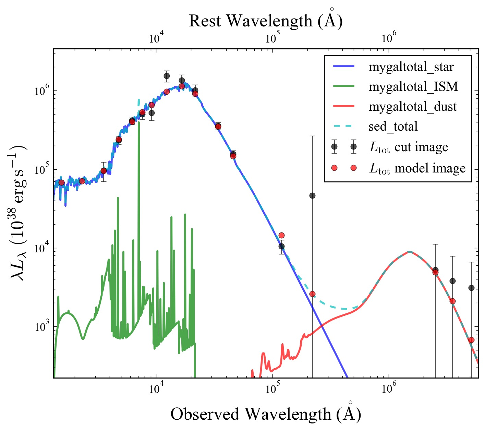
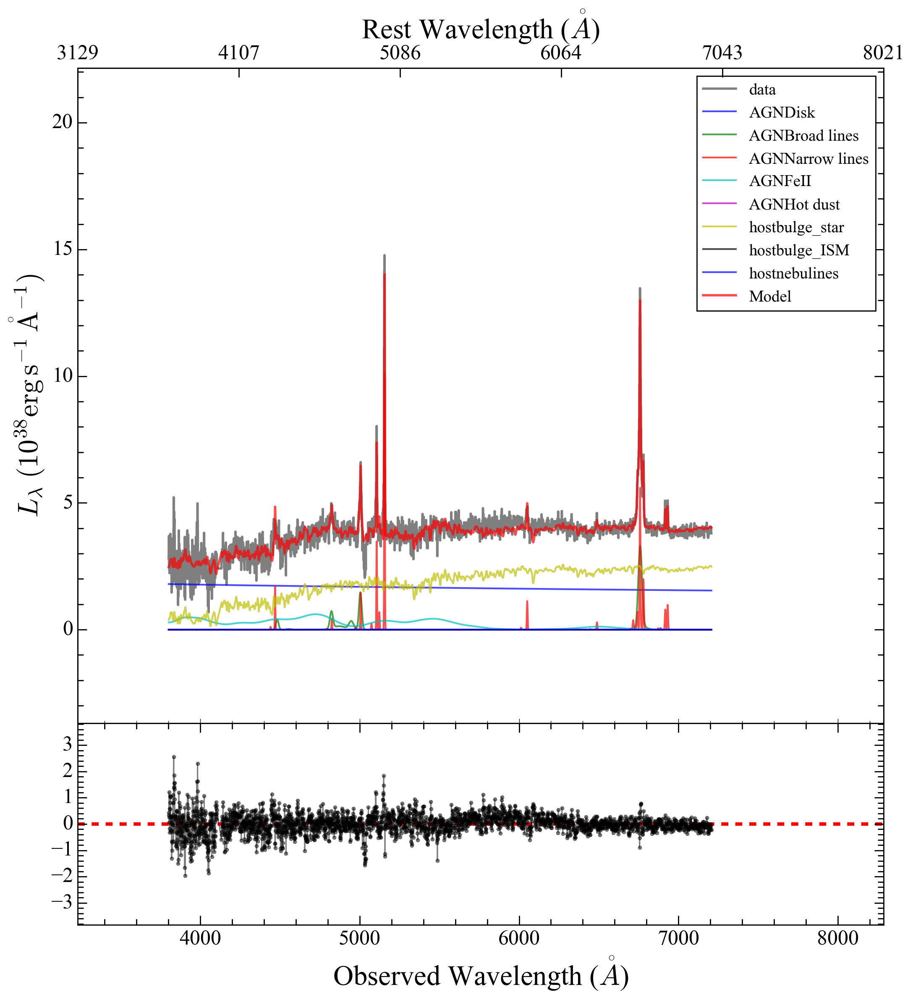

Examples of Config Files
=========================

Multi-band imaging decomposition
---------------------------------

Performing multi-band imaging decomposition with a simultaneous SED modeling is a fundamental task with GalfitS. We provide a example as the quickstart of GalfitS, see the :doc:`Quickstart <quickstart>` .

**Pure mophology fitting**: You can also set all the 15th paramter of images to be False, e.g. ``Ia15)`` to 0. In this case, only magnitude of each component/band will be fitted. This mode is useful to perform photometry, in this case, you have to set the magnitude zero point, e.g. ``Ia10)``, correct,   

Pure SED fitting
--------------------

Photometric SED fitting involves modeling the SED of an astronomical object using a set of data points derived from broad-band photometry. In GalfitS, this process begins by transforming photometric data into 'mock' images, followed by the standard fitting routine. The photometric data is typically provided in a table format, including columns for the band, flux, and flux error. Here’s an example:

.. list-table::
   :header-rows: 1

   * - Band
     - Flux
     - Flux_err
   * - NUV
     - xxx
     - xxx
   * - FUV
     - xxx
     - xxx
   * - ...
     - ...
     - ...

**Transforming Photometry Data to Mock Images**

To convert this photometric data into mock images, you can use the ``photometry_to_img`` function from the ``galfits.gsutils`` module. Below is an example Python script to perform this transformation:

.. code-block:: python

    from galfits import gsutils
    object_flux = Table.read('./object.mag', format='ascii')
    z = object['redshift']
    Bands = ['galex_nuv', 'galex_fuv', 'sloan_u', 'sloan_g', 'sloan_r', 'sloan_i', 'sloan_z', 'wise_ch1', 'wise_ch2', 'wise_ch3', 'wise_ch4']
    for loop, band in enumerate(Bands):
        flux_mjy = object_flux[band]
        flux_err = object_flux[band + '_err']
        outputname = './data/' + band + '.fits'
        gsutils.photometry_to_img(band, flux_mjy, flux_err, z, outputname, unit='mJy')

This script generates a set of mock images, one for each photometric band, which are then used in the SED fitting process.

**Configuration File for SED Fitting**

An example configuration file for performing SED fitting from the far-ultraviolet (FUV) to the far-infrared (FIR) is available at `SEDfit.lyric <https://github.com/RuancunLi/GalfitS-Public/tree/main/examples/SEDfit.lyric>`_. In this setup, each photometric data point is treated as an image. Below is an excerpt showing how to configure a photometric data point:

.. code-block:: none

    # Image A
    Ia1) [/home/liruancun/Works/liyang/cutimgs/photometry/2sloan_u.fits,0] 
    Ia2) sloan_u      # band
    Ia3) [/home/liruancun/Works/liyang/cutimgs/photometry/2sloan_u.fits,2] 
    Ia4) [/home/liruancun/Works/liyang/cutimgs/photometry/2sloan_u.fits,3] 
    Ia5) 1                   # PSF fine sampling factor relative to data
    Ia6) [Noimg,0] 
    Ia7) cR                # unit of the image
    Ia8) -1 
    Ia9) 1                # Conversion from image unit to flambda, -1 for default
    Ia10) 28.3291              # Magnitude photometric zeropoint
    Ia11) uniform             # sky model
    Ia12) [[0,-0.5,0.5,0.1,0]]                   # sky parameter, (value, min, max, step)
    Ia13) 0 			# allow relative shifting
    Ia14) [[0,-5,5,0.1,0],[0,-5,5,0.1,0]] # [shiftx, shifty]
    Ia15) 1 # Use SED information

**Important Notes:**

- The ``Ia8)`` parameter is set to -1, indicating that the image size is not used in the conventional sense, as this is a mock image for SED fitting.
- The ``Ia9)`` parameter is set to 1, which is essential for converting image units to flux density units (flambda). Using -1 would apply the default conversion, but specifying 1 ensures the correct transformation for SED fitting.

**Fitting Results**

Once the fitting process is complete, the results are saved in a summary file, accompanied by a figure illustrating the SED fitting outcome. The figure below displays the contributions from different components: stars (blue), nebular emission (green), and dust (red).

   Example of SED fitting results, showing contributions from stars (blue), nebular emission (green), and dust (red).

**Performance**

The time required to run this SED fitting example varies depending on the machine. Below is a table summarizing approximate fitting times:

.. list-table::
   :header-rows: 1

   * - Machine
     - Time
   * - RTX 4090
     - 1.5 mins

Spectrum fitting
---------------------

To perform spectrum-only fitting in GalfitS, the input spectrum is typically provided as a table without a header. The first column represents the wavelength in angstroms (Å), the second column is the flux (:math:`F_\lambda`), and the third column is the flux error. An example snippet of such data might look like this:

.. code-block:: none

    3000  xxx  xxx

An example dataset of an AGN spectrum is available at `GreeneHo2004_id2.txt <https://github.com/RuancunLi/GalfitS-Public/tree/main/examples/GreeneHo2004_id2.txt>`_.

We will use an example of AGN spectrum decomposition to illustrate the functionality of GalfitS. The example configuration file is `AGNspectrum.lyric <https://github.com/RuancunLi/GalfitS-Public/tree/main/examples/AGNspectrum.lyric>`_.

**Configuration for Spectrum Input**

In the config file for spectrum fitting, spatial parameters like ``R2)`` and ``R3)`` (region information) become irrelevant and do not need to be configured. To input a spectrum, the following section is used:

.. code-block:: none

    # Spectrum 
    Sa1) GreeneHo2004_id2.txt                  # spectrum file
    Sa2) 1                                     # conversion from spectrum unit to 1e-17 flambda
    Sa3) [3600., 7000.]                        # wavelength range
    Sa4) 0                                     # use high resolution stellar template 

    # Image atlas
    Ab1) sdss                                  # name of the image atlas
    Ab2) []                                    # images in this atlas
    Ab3) 1                                     # whether the images have same pixel size
    Ab4) 1                                     # link relative shiftings
    Ab5) ['a']                                 # spectra
    Ab6) [[2]]                                 # aperture size
    Ab7) [-1]                                  # references images

Here, the spectrum is integrated into an image atlas class via ``Ab5)``. Key notes:

- ``Sa2)``: Specifies the conversion factor from the spectrum’s native unit to :math:`10^{-17} F_\lambda`. Adjust this based on your data’s units.
- ``Sa3)``: Defines the wavelength range for fitting in the rest frame (e.g., 3600–7000 Å).
- ``Sa4)``: Determines the resolution of the stellar template. The default resolution is 150 km/s (``Sa4) 0``). To measure velocity dispersion accurately, set ``Sa4) 1`` to use a high-resolution template (30 km/s).
- ``Ab6)``: Specifies the aperture size. Since this is a single spectrum, no reference image is needed for slit/filter geometry (``Ab7) -1``).

**Model Parameters**

In `AGNspectrum.lyric <https://github.com/RuancunLi/GalfitS-Public/tree/main/examples/AGNspectrum.lyric>`_, geometric parameters for the host galaxy (e.g., ``Pa3)-Pa8)``) and AGN (e.g., ``Na4)-Na5)``) are not relevant for spectrum-only fitting. Below are some key parameters for the host galaxy and AGN:

.. code-block:: none

    Pa9) [[-2,-4,0,0.1,1]]                    # contemporary log star formation fraction
    Pa10) [[5,0.01,11,0.1,1]]                 # burst stellar age [Gyr]
    Pa11) [[0.02,0.001,0.04,0.001,0]]         # metallicity [Z=0.02=Solar]
    Pa12) [[0.7,0.3,5.1,0.1,1]]              # Av dust extinction [mag]
    Pa13) [100,40,300,1,0]                    # stellar velocity dispersion
    Pa14) [10.14,8.5,12,0.1,1]                # log stellar mass
    Pa15) conti                                # star formation history type: burst/conti
    ...
    Na10) [43,41,47,0.1,1]                    # log L5100
    Na11) [[1,0,4,0.1,1], [0.6, 0, 5, 0.1,0]] # power law indexes
    Na12) ['Hg','Hb','HeII_4686','Ha']        # broad emission lines
    Na13) ['Hg','Hb','HeII_4686','OIII_4959','OIII_5007','HeI','Ha','OI_6302','NII_6549','NII_6583','SII_6716','SII_6731'] # narrow emission lines
    Na14) 2                                    # number of components for broad lines
    Na15) 2                                    # number of components for narrow lines
    Na16) 0                                    # add Balmer continuum
    Na17) 1                                    # add FeII
    Na18) 0                                    # continuum model, 0: power law, 1: broken power law, 2: thin disk

For the host galaxy, we use a continuous star formation history (``Pa15) conti``), parameterized by the contemporary log star formation fraction (``Pa9)``) and the burst stellar age (``Pa10)``). To study velocity dispersion, set ``Pa13)`` to be free (last value = 1). For the AGN, we adopt a single power-law continuum model (``Na18) 0``), include FeII pseudo-continuum (``Na17) 1``), and exclude the Balmer continuum (``Na16) 0``) due to wavelength coverage. The broad (``Na12)``) and narrow (``Na13)``) emission lines must match definitions in `emission_lines.py <https://github.com/RuancunLi/GalfitS-Public/tree/main/src/galfits/emission_lines.py>`_. Adjust ``Na14)`` and ``Na15)`` to change the number of components.

**Running the Example**

Run the fitting with:

.. code-block:: bash

    galfits ./AGNspectrum.lyric --work ./result/ --num_s 20000

The result includes a figure:

   Example of spectrum fitting, where all subcomponents are labeled, and the bottom panel shows the residual.

**Manipulating Parameter Files**

After running, a parameter file (e.g., ``J0249-0815.params``) is generated in the ``result`` folder. You can modify it to refine the fit. Examples:

1. **Adjusting Hβ Broad Line Central Wavelength**:

   .. code-block:: none

       HbAGNb1wid 17.220163213245794 8.265678342357983 82.65678342357981 0.1 True None
       HbAGNb1peak 9975.021484375 0.0 99750.21875 99.75021362304688 True None
       HbAGNb1cen 4862.68 4812.68 4912.68 0.1 True None
       HbAGNb2wid 34.44032642649159 13.776130570596637 82.65678342357981 0.1 True None
       HbAGNb2peak 997.5021362304688 0.0 99750.21875 99.75021362304688 True None
       HbAGNb2cen 4862.68 4762.68 4962.68 0.1 True None
       HbAGNb3wid 34.44032642649159 13.776130570596637 82.65678342357981 0.1 True None
       HbAGNb3peak 997.5021362304688 0.0 99750.21875 99.75021362304688 True None
       HbAGNb3cen 4862.68 4762.68 4962.68 0.1 True None

   Here, the initial value and range of the central wavelength (``HbAGNb2cen``, ``HbAGNb3cen``) for the 2nd and 3rd broad Hβ components are adjusted to 4762.68–4962.68 Å.

2. **Reducing HeII Broad Components**:

   .. code-block:: none

       HeII_4686AGNb1wid 16.598100097836443 7.967088046961493 79.67088046961493 0.1 True None
       HeII_4686AGNb1peak 5994.80859375 0.0 59948.0859375 59.94808578491211 True None
       HeII_4686AGNb1cen 4687.02 4637.02 4737.02 0.1 True None
       HeII_4686AGNb2wid 33.19620019567289 13.278480078269151 79.67088046961493 0.1 False None
       HeII_4686AGNb2peak 0.0 0.0 59948.0859375 59.94808578491211 False None
       HeII_4686AGNb2cen 4687.02 4487.02 4887.02 0.1 False None
       HeII_4686AGNb3wid 33.19620019567289 13.278480078269151 79.67088046961493 0.1 False None
       HeII_4686AGNb3peak 0.0 0.0 59948.0859375 59.94808578491211 False None
       HeII_4686AGNb3cen 4687.02 4487.02 4887.02 0.1 False None

   This reduces the HeII fit to one broad component by setting the 2nd and 3rd components’ peak to 0 and fixing their parameters (``False``).

3. **Adding Broad Wings to OIII**:

   .. code-block:: none

       OIII_4959AGNb1wid 17.56584629995127 8.431606223976612 84.31606223976611 0.1 False 0.990426571*OIII_5007AGNb1wid
       OIII_4959AGNb1peak 1000.0 0.0 1725463.875 172.54638671875 False 0.33557*OIII_5007AGNb1peak
       OIII_4959AGNb1cen 4950.295 4910.295 5010.295 0.1 False 0.990426571*OIII_5007AGNb1cen
       OIII_4959AGNb2wid 35.13169259990254 14.052677039961017 84.31606223976611 0.1 False None
       OIII_4959AGNb2peak 0.0 0.0 93883.40625 93.88340759277344 False None
       OIII_4959AGNb2cen 4960.295 4760.295 5160.295 0.1 False None
       OIII_4959AGNb3wid 35.13169259990254 14.052677039961017 84.31606223976611 0.1 False None
       OIII_4959AGNb3peak 0.0 0.0 93883.40625 93.88340759277344 False None
       OIII_4959AGNb3cen 4960.295 4760.295 5160.295 0.1 False None
       OIII_5007AGNb1wid 17.73563348011922 1.418 85.13104070457226 0.1 True None
       OIII_5007AGNb1peak 3000.0 0.0 172546.390625 172.54638671875 True None
       OIII_5007AGNb1cen 5000.0 4958.24 5058.24 0.1 True None
       OIII_5007AGNb2wid 35.47126696023844 14.188506784095374 85.13104070457226 0.1 False None
       OIII_5007AGNb2peak 0.0 0.0 172546.390625 172.54638671875 False None
       OIII_5007AGNb2cen 5008.24 4808.24 5208.24 0.1 False None
       OIII_5007AGNb3wid 35.47126696023844 14.188506784095374 85.13104070457226 0.1 False None
       OIII_5007AGNb3peak 0.0 0.0 172546.390625 172.54638671875 False None
       OIII_5007AGNb3cen 5008.24 4808.24 5208.24 0.1 False None

   This adds a broad wing to OIII, linking ``OIII_4959AGNb1`` to ``OIII_5007AGNb1`` (width, peak, and center) while shutting down the other two components.

**Performance**

The time required to run this spectrum fitting example varies by machine:

.. list-table::
   :header-rows: 1

   * - Machine
     - Time
   * - RTX 4090
     - 0.5 mins

Imaging + spectrum fitting
----------------------------

Grism imaging fitting
-----------------------------