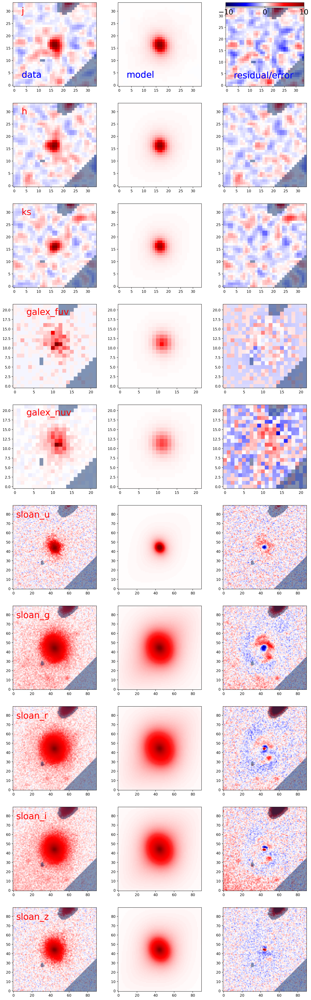
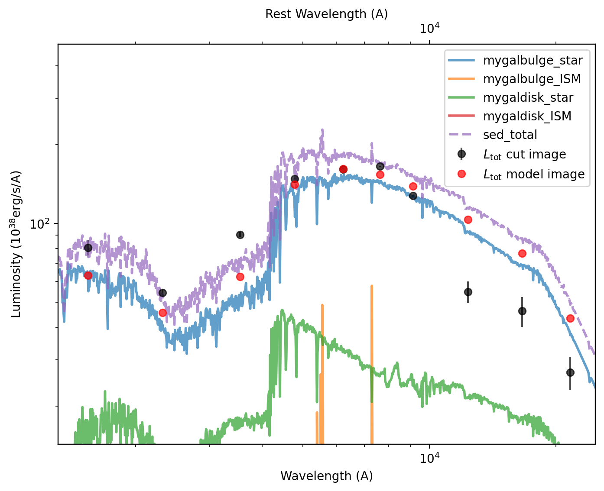

Quick Start to GalfitS Everything
==================================

We will use GalfitS to perform a bulge-disk decomposition of a galaxy J0100+0033, using multi-band images from 10 images from GALEX, SDSS, and 2MASS. The data can be downloaded from `data.zip <../../../examples/data.zip>`_

We will use the configuration file `quickstart.lyric <../../../examples/quickstart.lyric>`_ to run GalfitS. Let's first move to the directory where the data is located:

.. code-block:: bash

    unzip ../../examples/data.zip
    cd data
    mv ../quickstart.lyric .

Now we can run GalfitS:

.. code-block:: bash

    galfits quickstart.lyric --work ./result --num_steps 15000

The result will be saved in the directory ``result``. We choose 15000 steps to ensure the result is converged.

Now we can check the result. First, in the directory ``result``, there is a summary file named ``J0100+0033.gssummary``. The first part of the file looks like this:

.. code-block:: none

    # target: J0100+0033
    # config file: quickstart.lyric
    # fitting mode: images - SED
    # fiting method: optimizer
    # chisq: 22315.6640625
    # reduced chisq: 0.5555997490882874
    # BIC: 22750.294921875
    # fitting time: 11.854264557361603 mins
    ############# data summary ############## 
    # image atals: 2mass
    #    image number: 0  band: j  chisq: [765.8574]  dof: [1031.]  reduced chisq: [0.7428297]
    #    image number: 1  band: h  chisq: [384.72656]  dof: [1031.]  reduced chisq: [0.37315863]
    #    image number: 2  band: ks  chisq: [498.39984]  dof: [1031.]  reduced chisq: [0.483414]
    # image atals: galex
    #    image number: 0  band: galex_fuv  chisq: [185.44553]  dof: [434.]  reduced chisq: [0.42729384]
    #    image number: 1  band: galex_nuv  chisq: [545.28754]  dof: [434.]  reduced chisq: [1.2564229]
    # image atals: sdss
    #    image number: 0  band: sloan_u  chisq: [3681.2524]  dof: [7249.]  reduced chisq: [0.507829]
    #    image number: 1  band: sloan_g  chisq: [4718.369]  dof: [7249.]  reduced chisq: [0.6508993]
    #    image number: 2  band: sloan_r  chisq: [3916.7212]  dof: [7249.]  reduced chisq: [0.54031193]
    #    image number: 3  band: sloan_i  chisq: [4737.5195]  dof: [7249.]  reduced chisq: [0.6535411]
    #    image number: 4  band: sloan_z  chisq: [2882.086]  dof: [7249.]  reduced chisq: [0.39758393]

This summary provides an overview of the fitting results, including the target name, configuration file, fitting mode, method, chi-square values, reduced chi-square, Bayesian Information Criterion (BIC), and the fitting time. It also includes a detailed breakdown of the chi-square values for each image in the different image atlases (GALEX, SDSS, 2MASS), showing the chi-square, degrees of freedom (dof), and reduced chi-square for each band.

The second part of the file is the summary of the parameters:

.. code-block:: none

    pname    best_value
    disk_age_value    1.5849
    disk_Z_value    0.0300
    disk_Av_value    0.4300
    logM_disk    10.2398
    disk_xcen    -0.5388
    disk_ycen    -0.3541
    disk_Re    15.0592
    disk_ang    -43.6280
    disk_axrat    0.4126
    bulge_age_value    0.3981
    bulge_Z_value    0.0200
    bulge_Av_value    1.0165
    logM_bulge    10.6108
    bulge_xcen    -0.1534
    bulge_ycen    -0.1036
    bulge_Re    3.1752
    bulge_n    4.2031
    bulge_ang    24.9169
    bulge_axrat    0.7701
    ......

This table lists the best-fit values for each parameter, such as the age, metallicity (Z), dust extinction (Av), logarithmic stellar mass (logM), and structural parameters (e.g., effective radius Re, position angle ang, axis ratio axrat) for both the disk and bulge components.

The above file can be easily read using ``astropy.table``, for example:

.. code-block:: python

    import astropy.table as Table 
    result = Table.read('result/J0100+0033.gssummary', format='ascii')
    logM_bulge = result['best_value'][result['pname'] == 'logM_bulge'][0]

Besides the summary files, there are also two output images. The first is ``J0100+0033image_fit.png``, which displays the original image, the model image, and the residual image for each band:

The second output image is ``J0100+0033SED_model.png``, which shows the SED model for the bulge and disk components, along with the model points for each band and a simple photometry measurement:

Running the above example takes different times on different machines. Below is a table summarizing the approximate fitting times:

.. list-table::
   :header-rows: 1

   * - Machine
     - Time
   * - RTX 4090
     - 11.89 mins
   * - CPU
     - 20 mins